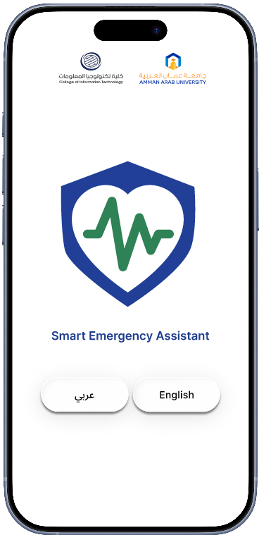
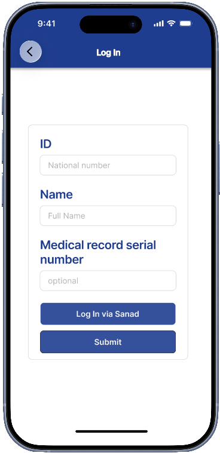
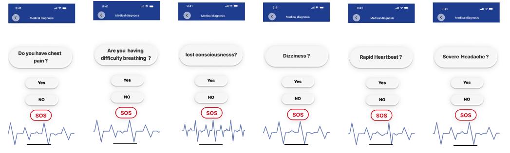
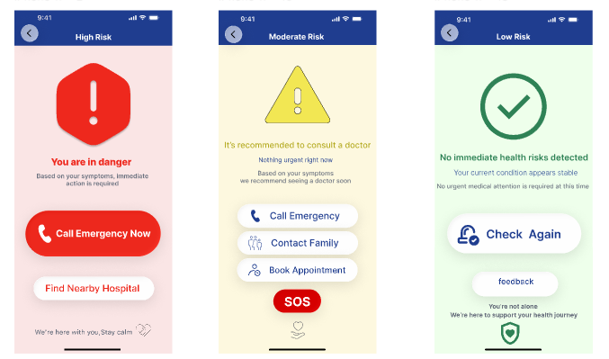
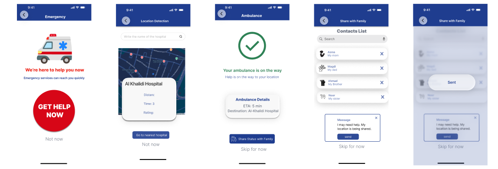
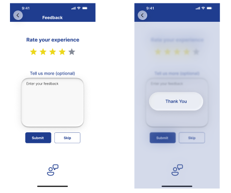

# Smart Emergency Assistance

Smart Emergency Assistance is a healthcare-focused UI/UX project developed as part of the AAU XDT Competition.

The application is designed to help users assess emergency health situations through a simple, accessible, and user-friendly interface. The project focuses on improving user experience, accessibility, and providing guidance during emergency situations.

## Project Overview

This project was created using Figma and includes a complete user journey starting from onboarding screens, health assessment questions, risk evaluation, emergency support options, and feedback collection.

## Tools Used

- Figma
- UI/UX Design
- Prototyping

## Key Features

- User-friendly healthcare interface
- Emergency health assessment flow
- Interactive question screens
- Risk evaluation and guidance
- SOS emergency support screen
- Accessible and simple navigation
- Modern UI/UX design

## My Contributions

- Designed user interfaces and screen layouts
- Planned user flows and navigation paths
- Created interactive prototypes using Figma
- Focused on accessibility and usability principles
- Participated in developing the project for the AAU XDT Competition

## Figma Prototype

[View Interactive Prototype](https://www.figma.com/design/uSzW3myEljw4gi5VdSeUQJ/smart-emergency-assistance?node-id=0-1&t=OmKbar9wlT4SVdmk-1)

## Screenshots

### Welcome Screen

### Login Screen

### Questions Screen

### Risk Assessment Screen

### SOS Screen

### Feedback Screen

## Project Type

UI/UX Competition Project

## Author

Nour Sharabati
